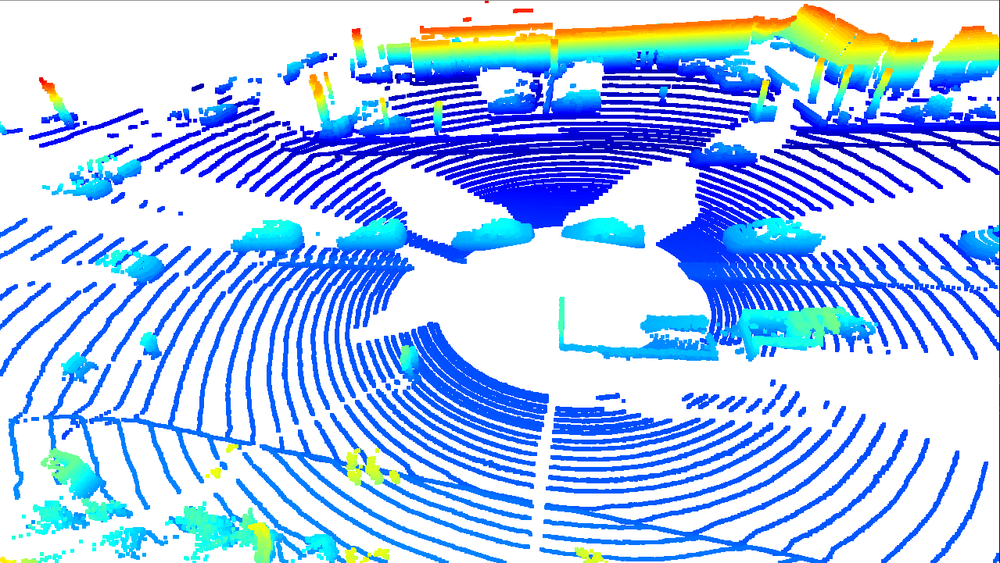
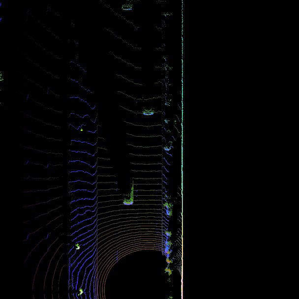
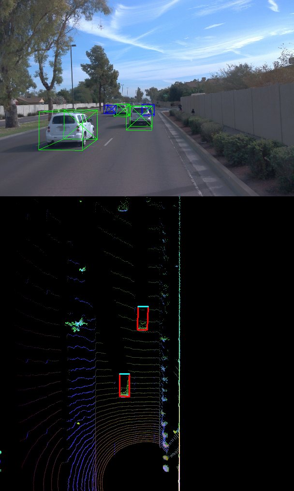
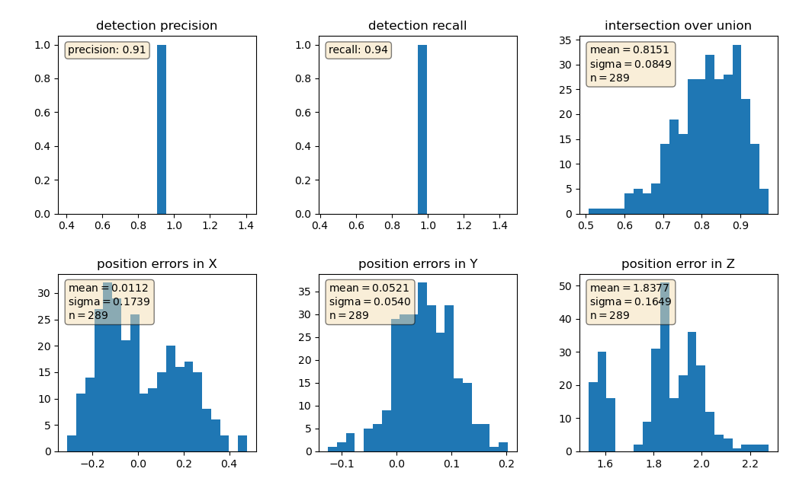
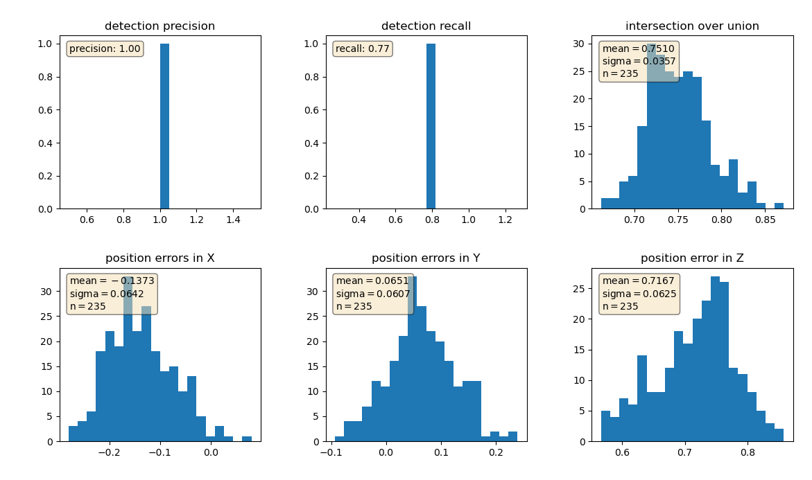
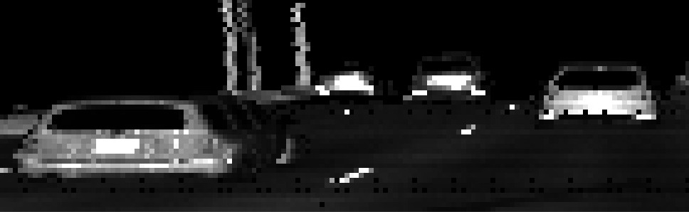

# SDCND : Sensor Fusion and Tracking

# Overview

In this project, you'll fuse measurements from LiDAR and camera and track vehicles over time. You will be using real-world data from the Waymo Open Dataset, detect objects in 3D point clouds and apply an extended Kalman filter for sensor fusion and tracking.

The project consists of two major parts: 
1. **Object detection**: In this part, a deep-learning approach is used to detect vehicles in LiDAR data based on a birds-eye view perspective of the 3D point-cloud. Also, a series of performance measures is used to evaluate the performance of the detection approach. 
2. **Object tracking** : In this part, an extended Kalman filter is used to track vehicles over time, based on the lidar detections fused with camera detections. Data association and track management are implemented as well.

For a full description of the project and setup instruction, please see the [original README.md](README_original.md)

# Solution

## Object detection

Height and intensity extracted from Lidar range image:

Point cloud visualization using Open3D

3-channel BEV map containing density (red), height (green) and intensity (blue) data.

Integrated pre-trained FPN ResNet model for object detection 

Precision, recall and metrics calculated using Darknet and FPN ResNet for detection 

# Answers to questions

2 examples of vehicles with high visibility:

2 examples of vehicles with medium visibility:

2 examples of vehicles with low visibility:

A highly stable feature in the intensity image is the licence plate of the vehicles 
due to its material and bright color. It is not always available though, as in some areas 
vehicles do not need to carry licence plates both in the front/back. It is also not useful 
for detecting other types of objects (like bicycles).

